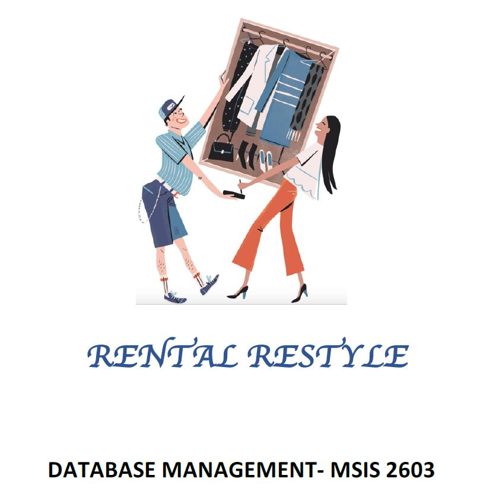

# Rental-Restyle-Database-Management-Systems-Project

This project was part of the course 'Database Management Systems'

- Designed the conceptual, logical, and physical model of a database for a Clothing Rental Service Management System and implemented it using MySQL.

- Created and populated the schema for a relational database by studying entities, relationships, attributes, and referential constraints.

- Implemented the UML model and Identified key Users, executed Triggers, Subqueries, Views, Indexes and Computed relavant Business Matrices for the application. 
